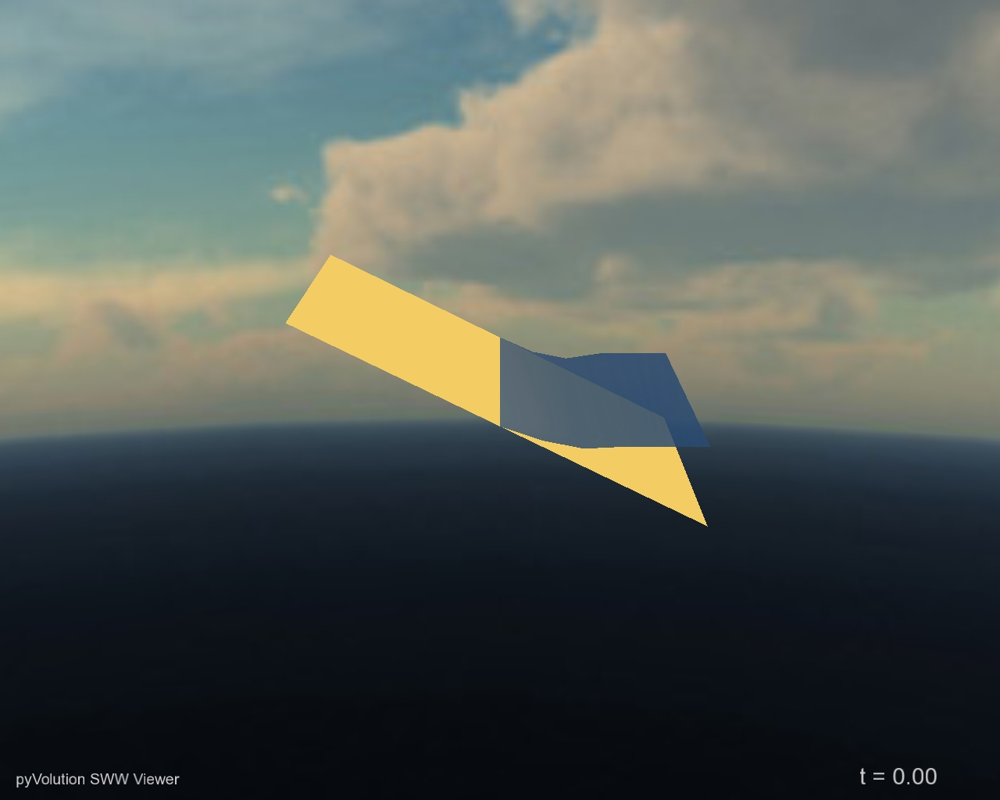
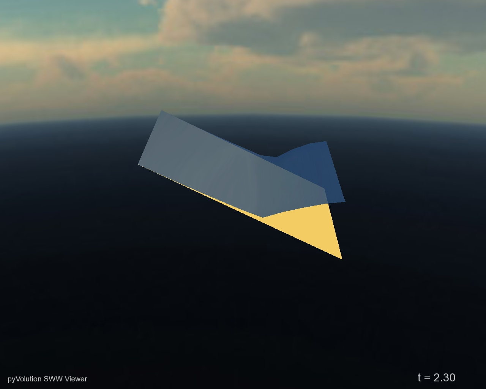
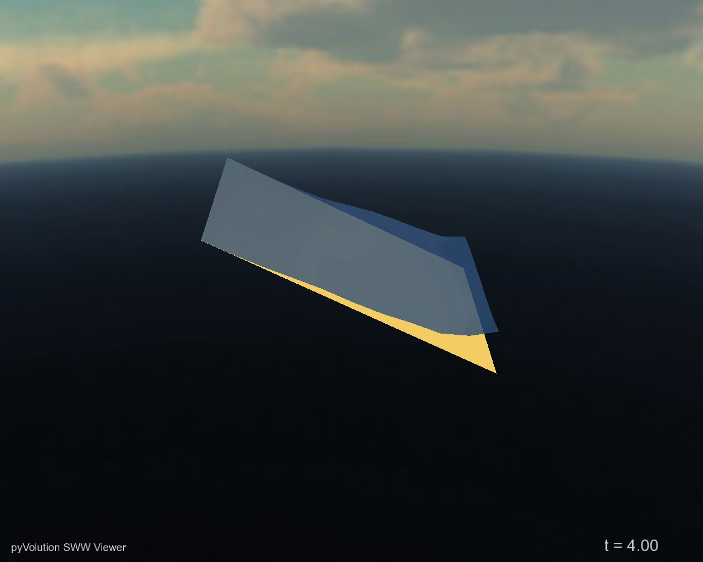

Simple Script Example
=====================

.. currentmodule:: anuga

Here we discuss the structure and operation of a
script called :code:`runup.py` (which is available in the :code:`examples`
directory of :code:`anuga_core`.

This example carries out the solution of the shallow-water wave
equation in the simple case of a configuration comprising a flat
bed, sloping at a fixed angle in one direction and having a
constant depth across each line in the perpendicular direction.

The example demonstrates the basic ideas involved in setting up a
complex scenario. In general the user specifies the geometry
(bathymetry and topography), the initial water level, boundary
conditions such as tide, and any forcing terms that may drive the
system such as rainfall, abstraction of water, wind stress or atmospheric pressure gradients.
Frictional resistance from the different terrains in the model is
represented by predefined forcing terms. In this example, the
boundary is reflective on three sides and a time dependent wave on
one side.

The present example represents a simple scenario and does not
include any forcing terms, nor is the data taken from a file as it
would typically be.

The conserved quantities involved in the
problem are stage (absolute height of water surface),
:math:`x`-momentum and :math:`y`-momentum. Other quantities
involved in the computation are the friction and elevation.

Water depth can be obtained through the equation:

.. code-block:: python

    depth = stage - elevation

Outline of the Program
----------------------

In outline, :code:`runup.py` performs the following steps:

   * Sets up a triangular mesh.
   * Sets certain parameters governing the mode of operation of the model, 
     specifying, for instance, where to store the model output.
   * Inputs various quantities describing physical measurements, 
     such as the elevation, to be specified at each mesh point (vertex).
   * Sets up the boundary conditions.
   * Carries out the evolution of the model through a series of time steps 
     and outputs the results, providing a results file that can be viewed.

The Code
--------

For reference we include below the complete code listing for
:code:`runup.py`. Subsequent paragraphs provide a
'commentary' that describes each step of the program and explains it
significance.

.. literalinclude:: ../../../examples/simple_examples/runup.py

Establishing the Domain
-----------------------

The very first thing to do is import the various modules, of which the
:code:`anuga` module is the most important:

.. code-block:: python

    import anuga

Then we need to set up the triangular mesh to be used for the
scenario. This is carried out through the statement:

.. code-block:: python

    domain = anuga.rectangular_cross_domain(10, 5, len1=10.0, len2=5.0)

The above assignment sets up a :math:`10 \times 5` rectangular mesh, 
triangulated in a regular way with boundary tags 
:code:`left`, :code:`right`, :code:`top` or :code:`bottom`.

It is also possible to set up a domain from "first principles" 
using :code:`points`, :code:`vertices` and :code:`boundary` via the assignment:

.. code-block:: python

    points, vertices, boundary = anuga.rectangular_cross(10, 5, len1=10.0, len2=5.0)
    domain = anuga.Domain(points, vertices, boundary)

where:
    * :code:`points` is a list giving the coordinates of each mesh point,
    * :code:`vertices` is a list specifying the three vertices of each triangle, and
    * :code:`boundary` is a dictionary that stores the edges on the boundary and associates 
      with each a symbolic tag. The edges are represented as pairs (i, j) 
      where i refers to the triangle id and j to the edge id of that triangle. 
      Edge ids are enumerated from 0 to 2 based on the id of the vertex opposite.

This creates an instance of the :code:`Domain` class, which
represents the domain of the simulation. Specific options are set at
this point, including the basename for the output file and the
directory to be used for data:

.. code-block:: python

    domain.set_name('runup')
    domain.set_datadir('.')

In addition, the following statement could be used to state that
quantities :code:`stage`, :code:`xmomentum` and :code:`ymomentum` are
to be stored at every timestep and :code:`elevation` only once at
the beginning of the simulation:

.. code-block:: python

    domain.set_quantities_to_be_stored({'stage': 2, 'xmomentum': 2, 'ymomentum': 2, 'elevation': 1})

However, this is not necessary, as the above is the default behaviour.

Initial Conditions
------------------

The next task is to specify a number of quantities that we wish to
set for each mesh point. The class :code:`{Domain` has a method
:code:`set_quantity`, used to specify these quantities. It is a
flexible method that allows the user to set quantities in a variety
of ways -- using constants, functions, numeric arrays, expressions
involving other quantities, or arbitrary data points with associated
values, all of which can be passed as arguments. All quantities can
be initialised using :code:`set\_quantity`. For a conserved
quantity (such as :code:`stage, xmomentum, ymomentum`) this is called
an *initial condition*. However, other quantities that aren't
updated by the evolution procedure are also assigned values using the same
interface. The code in the present example demonstrates a number of
forms in which we can invoke :code:`set_quantity`.

Elevation
~~~~~~~~~~

The elevation, or height of the bed, is set using a function
defined through the statements below, which is specific to this
example and specifies a particularly simple initial configuration
for demonstration purposes:

.. code-block:: python

    def topography(x, y):
        return -x/2

This simply associates an elevation with each point :code:`(x, y)` of
the plane.  It specifies that the bed slopes linearly in the
:code:`x` direction, with slope :math:`-\frac{1}{2}`,  and is constant in
the :code:`y` direction.

Once the function :code:`topography` is specified, the quantity
:code:`elevation` is assigned through the statement:

.. code-block:: python

    domain.set_quantity('elevation', topography)

.. note::
    If using a function to set a quantity such as :code:`elevation` it must be vector
    compatible. For example, using :code:`math.sqrt` will not work, but :code:`numpy.sqrt` will work. 

Friction
~~~~~~~~

The assignment of the friction quantity (a forcing term)
demonstrates another way we can use :code:`set_quantity` to set
quantities -- namely, assign them to a constant numerical value:

.. code-block:: python

    domain.set_quantity('friction', 0.1)

This specifies that the Manning friction coefficient is set to 0.1
at every mesh point.

Stage
~~~~~

The stage (the height of the water surface) is related to the
elevation and the depth at any time by the equation:

.. code-block:: python

    stage = elevation + depth

For this example, we simply assign a constant value to :code:`stage`,
using the statement:

.. code-block:: python

    domain.set_quantity('stage', -0.4)

which specifies that the surface level is set to a height of :math:`-0.4`,
i.e. 0.4 units (metres) below the zero level.

Although it is not necessary for this example, it may be useful to
digress here and mention a variant to this requirement, which allows
us to illustrate another way to use :code:`set_quantity` -- namely,
incorporating an expression involving other quantities. Suppose,
instead of setting a constant value for the stage, we wished to
specify a constant value for the *depth*. For such a case we
need to specify that :code:`stage` is everywhere obtained by adding
that value to the value already specified for :code:`elevation`. We
would do this by means of the statements:

.. code-block:: python

    h = 0.05    # Constant depth
    domain.set_quantity('stage', expression='elevation + %f' % h)

That is, the value of :code:`stage` is set to :code:`h = 0.05` plus
the value of :code:`elevation` already defined.

The reader will probably appreciate that this capability to
incorporate expressions into statements using :code:`set_quantity`
greatly expands its power. 

Boundary Conditions
-------------------

The boundary conditions are specified as follows:

.. code-block:: python

    Br = anuga.Reflective_boundary(domain)
    Bw = anuga.Time_boundary(domain=domain, f=lambda t: [(0.1*sin(t*2*pi)-0.3)*exp(-t), 0.0, 0.0])

The effect of these statements is to set up a selection of different
alternative boundary conditions and store them in variables that can be
assigned as needed. Each boundary condition specifies the
behaviour at a boundary in terms of the behaviour in neighbouring
elements. The boundary conditions introduced here may be briefly described as
follows:

  * Reflective boundary: Returns same :code:`stage` as in its neighbour volume but momentum
    vector reversed 180 degrees (reflected). 
    Specific to the shallow water equation as it works with the 
    momentum quantities assumed to be the second and third conserved quantities. 
    A reflective boundary condition models a solid wall.
  * Time boundary: Set a boundary varying with time.
  
Before describing how these boundary conditions are assigned,
we recall that a mesh is specified using
three variables :code:`points`, :code:`vertices` and :code:`boundary`.
In the code we are discussing, these three variables are returned by
the function :code:`rectangular_cross`. The example given in
Section \ref{sec:realdataexample} illustrates another way of
assigning the values, by means of the function
:code:`create_domain_from_regions`.

These variables store the data determining the mesh as follows. (You
may find that the example given in Section \ref{sec:meshexample}
helps to clarify the following discussion, even though that example
is a *non-rectangular* mesh.):

    * :code:`points` stores a list of 2-tuples giving the
      coordinates of the mesh points.
    * :code:`vertices` stores a list of 3-tuples of
      numbers, representing vertices of triangles in the mesh. In this
      list, the triangle whose vertices are :code:`points[i]`,
      :code:`points[j]`, :code:`points[k]` is represented by the 3-tuple :code:`(i, j, k)`.
    * The variable :code:`boundary` is a Python dictionary that
      not only stores the edges that make up the boundary but also assigns
      symbolic tags to these edges to distinguish different parts of the
      boundary. An edge with endpoints :code:`points[i]` and
      :code:`points[j]` is represented by the 2-tuple :code:`(i, j)`. The
      keys for the dictionary are the 2-tuples :code:`(i, j)` corresponding
      to boundary edges in the mesh, and the values are the tags are used
      to label them. In the present example, the value :code:`boundary[(i, j)]`
      assigned to :code:`(i, j)]` is one of the four tags
      :code:`left`, :code:`right`, :code:`top` or :code:`bottom`,
      depending on whether the boundary edge represented by :code:`(i, j)`
      occurs at the left, right, top or bottom of the rectangle bounding
      the mesh. The function :code:`rectangular_cross` automatically assigns
      these tags to the boundary edges when it generates the mesh.

The tags provide the means to assign different boundary conditions
to an edge depending on which part of the boundary it belongs to.
(In Section Real Example we describe an example that
uses different boundary tags -- in general, the possible tags are entirely 
selectable by the user when generating the mesh and not
limited to 'left', 'right', 'top' and 'bottom' as in this example.)
All segments in bounding polygon must be tagged. If a tag is not supplied, 
the default tag name :code:`exterior` will be assigned by ANUGA.

Using the boundary objects described above, we assign a boundary
condition to each part of the boundary by means of a statement like:

.. code-block:: python

    domain.set_boundary({'left': Br, 'right': Bw, 'top': Br, 'bottom': Br})

It is critical that all tags are associated with a boundary condition in this statement.
If not the program will halt with a statement like:

.. code-block:: bash

    Traceback (most recent call last):
    File "mesh_test.py", line 114, in ?
        domain.set_boundary({'west': Bi, 'east': Bo, 'north': Br, 'south': Br})
    File "X:\inundation\sandpits\onielsen\anuga_core\source\anuga\
        abstract_2d_finite_volumes\domain.py", line 505, in set_boundary
        raise msg
    ERROR (domain.py): Tag "exterior" has not been bound to a boundary object.
    All boundary tags defined in domain must appear in the supplied dictionary.
    The tags are: ['ocean', 'east', 'north', 'exterior', 'south']

The command :code:`set_boundary` stipulates that, in the current example, the right
boundary varies with time, as defined by the lambda function, while the other
boundaries are all reflective.

Evolution
---------

The final statement:

.. code-block:: python

    for t in domain.evolve(yieldstep=0.1, duration=10.0):
        domain.print_timestepping_statistics()

causes :code:`domain` we have just setup to *evolve*, over a series of
steps indicated by the values of :code:`yieldstep` and
:code:`duration`, which can be altered as required (an alternative 
to :code:`duration` is :code:`finaltime`)  The value of
:code:`yieldstep` provides the time interval between successive yields to the evolve loop.
Behind the scenes more *inner* time steps are generally taken.

By default, the current state of the evolution is stored a each yield step.   

Time between output can also be controlled by 
the argument :code:`outputstep` which needs to an integer multiple of the :code:`yieldstep`

Output
------

The output is a NetCDF file with the extension :code:`.sww`. It
contains stage and momentum information and can be used with the
ANUGA viewer :code:`anuga_viewer` to generate a visual
display. 

Exploring the Model Output
--------------------------

The following figures are screenshots from the anuga viewer visualisation
tool :code:`anuga_viewer`. 

The first figure shows the domain
with water surface as specified by the initial condition, :math:`t=0`.

The second figure shows the flow at time :math:`t=2.3` and the last figure 
show the flow at time  :math:`t=4` where the system has been evolved
and the wave is encroaching on the previously dry bed.

`Online documentation <https://anuga-viewer.readthedocs.io>`_ is available 
for the :code:`anuga_viewer`

.. _bedslopestart:

   Runup example viewed at time 0.0 with the ANUGA viewer

.. _bedslopeduring:

   Runup example viewed at time 2.3 with the ANUGA viewer

.. _bedslopeend:

   Runup example viewed time 4.0 with the ANUGA viewer  

